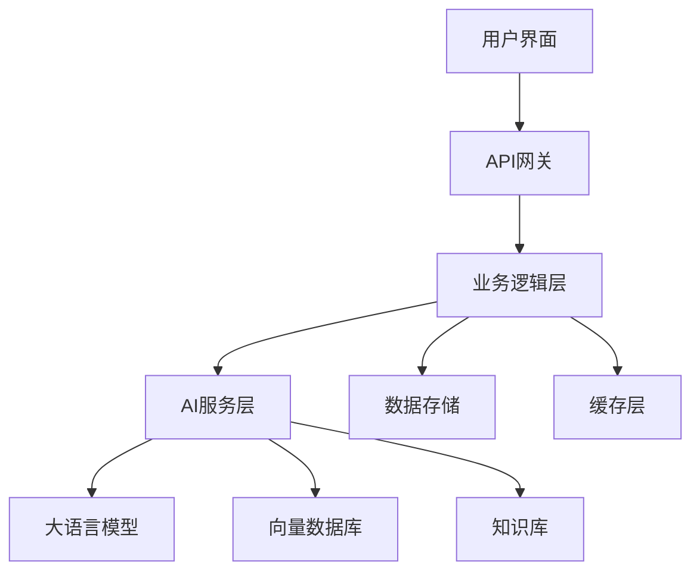

# 2025年AI应用开发完全指南：从概念到生产

随着大语言模型技术的快速发展，AI应用开发已经成为软件开发的重要分支。本文将深入探讨2025年AI应用开发的核心技术、架构模式和最佳实践。

## 1. AI应用开发技术栈概览

### 1.1 核心组件

现代AI应用通常包含以下核心组件：



### 1.2 技术选型

**前端框架**
- React/Vue.js + TypeScript
- Streamlit (快速原型)
- Gradio (ML演示)

**后端框架**
- FastAPI (Python)
- Express.js (Node.js)
- Gin (Go)

**AI/ML框架**
- LangChain/LangGraph
- LlamaIndex
- Haystack
- OpenAI SDK
- Anthropic SDK

## 2. 大语言模型集成

### 2.1 模型选择策略

```python
# 模型选择决策树
def choose_model(task_type, budget, latency_requirement):
    if task_type == "code_generation":
        if budget == "high":
            return "gpt-4-turbo"
        else:
            return "claude-3-haiku"
    
    elif task_type == "text_analysis":
        if latency_requirement == "low":
            return "gpt-3.5-turbo"
        else:
            return "claude-3-sonnet"
    
    elif task_type == "multimodal":
        return "gpt-4-vision" or "claude-3-opus"
```

### 2.2 API调用最佳实践

```python
import asyncio
import aiohttp
from typing import List, Dict
import backoff

class LLMClient:
    def __init__(self, api_key: str, base_url: str):
        self.api_key = api_key
        self.base_url = base_url
        self.session = None
    
    async def __aenter__(self):
        self.session = aiohttp.ClientSession()
        return self
    
    async def __aexit__(self, exc_type, exc_val, exc_tb):
        if self.session:
            await self.session.close()
    
    @backoff.on_exception(
        backoff.expo,
        (aiohttp.ClientError, asyncio.TimeoutError),
        max_tries=3
    )
    async def generate_completion(
        self, 
        messages: List[Dict], 
        model: str = "gpt-4-turbo",
        temperature: float = 0.7
    ) -> str:
        headers = {
            "Authorization": f"Bearer {self.api_key}",
            "Content-Type": "application/json"
        }
        
        payload = {
            "model": model,
            "messages": messages,
            "temperature": temperature,
            "max_tokens": 2000
        }
        
        async with self.session.post(
            f"{self.base_url}/chat/completions",
            headers=headers,
            json=payload,
            timeout=aiohttp.ClientTimeout(total=30)
        ) as response:
            response.raise_for_status()
            data = await response.json()
            return data["choices"][0]["message"]["content"]

# 使用示例
async def main():
    async with LLMClient("your-api-key", "https://api.openai.com/v1") as client:
        messages = [
            {"role": "system", "content": "你是一个专业的AI助手"},
            {"role": "user", "content": "解释什么是RAG系统"}
        ]
        response = await client.generate_completion(messages)
        print(response)
```

## 3. RAG系统架构设计

### 3.1 RAG系统核心组件

```python
from langchain.embeddings import OpenAIEmbeddings
from langchain.vectorstores import Chroma
from langchain.text_splitter import RecursiveCharacterTextSplitter
from langchain.document_loaders import DirectoryLoader
from langchain.chains import RetrievalQA
from langchain.llms import OpenAI

class RAGSystem:
    def __init__(self, documents_path: str, persist_directory: str):
        self.documents_path = documents_path
        self.persist_directory = persist_directory
        self.embeddings = OpenAIEmbeddings()
        self.vectorstore = None
        self.qa_chain = None
        
    def load_and_process_documents(self):
        """加载和处理文档"""
        # 加载文档
        loader = DirectoryLoader(
            self.documents_path, 
            glob="**/*.md",
            show_progress=True
        )
        documents = loader.load()
        
        # 文档分割
        text_splitter = RecursiveCharacterTextSplitter(
            chunk_size=1000,
            chunk_overlap=200,
            length_function=len,
        )
        texts = text_splitter.split_documents(documents)
        
        # 创建向量存储
        self.vectorstore = Chroma.from_documents(
            documents=texts,
            embedding=self.embeddings,
            persist_directory=self.persist_directory
        )
        self.vectorstore.persist()
        
    def setup_qa_chain(self):
        """设置问答链"""
        if not self.vectorstore:
            self.vectorstore = Chroma(
                persist_directory=self.persist_directory,
                embedding_function=self.embeddings
            )
        
        self.qa_chain = RetrievalQA.from_chain_type(
            llm=OpenAI(temperature=0),
            chain_type="stuff",
            retriever=self.vectorstore.as_retriever(
                search_kwargs={"k": 3}
            ),
            return_source_documents=True
        )
    
    def query(self, question: str) -> Dict:
        """查询系统"""
        if not self.qa_chain:
            self.setup_qa_chain()
        
        result = self.qa_chain({"query": question})
        return {
            "answer": result["result"],
            "sources": [doc.metadata for doc in result["source_documents"]]
        }

# 使用示例
rag = RAGSystem("./documents", "./vectorstore")
rag.load_and_process_documents()
result = rag.query("什么是机器学习？")
print(result["answer"])
```

### 3.2 高级RAG优化技术

```python
class AdvancedRAGSystem:
    def __init__(self):
        self.query_rewriter = self._setup_query_rewriter()
        self.answer_synthesizer = self._setup_answer_synthesizer()
    
    def _setup_query_rewriter(self):
        """查询重写器"""
        return PromptTemplate(
            template="""
            原始查询: {original_query}
            
            请将上述查询重写为3个不同的搜索查询，以便更好地检索相关信息：
            1. 
            2. 
            3. 
            """,
            input_variables=["original_query"]
        )
    
    def _setup_answer_synthesizer(self):
        """答案合成器"""
        return PromptTemplate(
            template="""
            基于以下检索到的信息回答问题：
            
            问题: {question}
            
            检索信息:
            {retrieved_info}
            
            请提供准确、详细的答案，并在答案中标注信息来源。
            """,
            input_variables=["question", "retrieved_info"]
        )
    
    async def enhanced_query(self, question: str) -> str:
        """增强查询处理"""
        # 1. 查询重写
        rewritten_queries = await self._rewrite_query(question)
        
        # 2. 多查询检索
        all_docs = []
        for query in rewritten_queries:
            docs = await self._retrieve_documents(query)
            all_docs.extend(docs)
        
        # 3. 文档去重和排序
        unique_docs = self._deduplicate_and_rank(all_docs)
        
        # 4. 答案合成
        answer = await self._synthesize_answer(question, unique_docs)
        
        return answer
```

## 4. 多模态AI应用

### 4.1 图像理解应用

```python
import base64
from PIL import Image
import io

class MultimodalAI:
    def __init__(self, api_key: str):
        self.client = OpenAI(api_key=api_key)
    
    def encode_image(self, image_path: str) -> str:
        """编码图像为base64"""
        with open(image_path, "rb") as image_file:
            return base64.b64encode(image_file.read()).decode('utf-8')
    
    async def analyze_image(self, image_path: str, prompt: str) -> str:
        """分析图像"""
        base64_image = self.encode_image(image_path)
        
        response = await self.client.chat.completions.create(
            model="gpt-4-vision-preview",
            messages=[
                {
                    "role": "user",
                    "content": [
                        {"type": "text", "text": prompt},
                        {
                            "type": "image_url",
                            "image_url": {
                                "url": f"data:image/jpeg;base64,{base64_image}"
                            }
                        }
                    ]
                }
            ],
            max_tokens=1000
        )
        
        return response.choices[0].message.content
    
    async def generate_image_description(self, image_path: str) -> str:
        """生成图像描述"""
        prompt = """
        请详细描述这张图片的内容，包括：
        1. 主要对象和场景
        2. 颜色和构图
        3. 可能的用途或含义
        4. 任何文字内容
        """
        return await self.analyze_image(image_path, prompt)

# 使用示例
multimodal_ai = MultimodalAI("your-api-key")
description = await multimodal_ai.generate_image_description("screenshot.png")
print(description)
```

### 4.2 语音处理集成

```python
import whisper
from gtts import gTTS
import pygame
import io

class VoiceAI:
    def __init__(self):
        self.whisper_model = whisper.load_model("base")
    
    def speech_to_text(self, audio_file: str) -> str:
        """语音转文字"""
        result = self.whisper_model.transcribe(audio_file)
        return result["text"]
    
    def text_to_speech(self, text: str, lang: str = "zh") -> bytes:
        """文字转语音"""
        tts = gTTS(text=text, lang=lang)
        audio_buffer = io.BytesIO()
        tts.write_to_fp(audio_buffer)
        audio_buffer.seek(0)
        return audio_buffer.getvalue()
    
    def play_audio(self, audio_data: bytes):
        """播放音频"""
        pygame.mixer.init()
        audio_buffer = io.BytesIO(audio_data)
        pygame.mixer.music.load(audio_buffer)
        pygame.mixer.music.play()
```

## 5. 生产部署策略

### 5.1 容器化部署

```dockerfile
# Dockerfile
FROM python:3.11-slim

WORKDIR /app

# 安装系统依赖
RUN apt-get update && apt-get install -y \
    gcc \
    g++ \
    && rm -rf /var/lib/apt/lists/*

# 复制依赖文件
COPY requirements.txt .
RUN pip install --no-cache-dir -r requirements.txt

# 复制应用代码
COPY . .

# 设置环境变量
ENV PYTHONPATH=/app
ENV PYTHONUNBUFFERED=1

# 暴露端口
EXPOSE 8000

# 启动命令
CMD ["uvicorn", "main:app", "--host", "0.0.0.0", "--port", "8000"]
```

```yaml
# docker-compose.yml
version: '3.8'

services:
  ai-app:
    build: .
    ports:
      - "8000:8000"
    environment:
      - OPENAI_API_KEY=${OPENAI_API_KEY}
      - REDIS_URL=redis://redis:6379
    depends_on:
      - redis
      - postgres
    volumes:
      - ./data:/app/data
  
  redis:
    image: redis:7-alpine
    ports:
      - "6379:6379"
  
  postgres:
    image: postgres:15
    environment:
      - POSTGRES_DB=aiapp
      - POSTGRES_USER=user
      - POSTGRES_PASSWORD=password
    volumes:
      - postgres_data:/var/lib/postgresql/data
    ports:
      - "5432:5432"

volumes:
  postgres_data:
```

### 5.2 监控和日志

```python
import logging
from prometheus_client import Counter, Histogram, generate_latest
import time
from functools import wraps

# 指标定义
REQUEST_COUNT = Counter('ai_requests_total', 'Total AI requests', ['endpoint', 'status'])
REQUEST_DURATION = Histogram('ai_request_duration_seconds', 'Request duration')

def monitor_performance(func):
    """性能监控装饰器"""
    @wraps(func)
    async def wrapper(*args, **kwargs):
        start_time = time.time()
        status = "success"
        
        try:
            result = await func(*args, **kwargs)
            return result
        except Exception as e:
            status = "error"
            logging.error(f"Error in {func.__name__}: {str(e)}")
            raise
        finally:
            duration = time.time() - start_time
            REQUEST_DURATION.observe(duration)
            REQUEST_COUNT.labels(endpoint=func.__name__, status=status).inc()
    
    return wrapper

# 日志配置
logging.basicConfig(
    level=logging.INFO,
    format='%(asctime)s - %(name)s - %(levelname)s - %(message)s',
    handlers=[
        logging.FileHandler('ai_app.log'),
        logging.StreamHandler()
    ]
)

logger = logging.getLogger(__name__)

@monitor_performance
async def generate_response(prompt: str) -> str:
    """生成响应"""
    logger.info(f"Generating response for prompt: {prompt[:50]}...")
    # AI处理逻辑
    response = await ai_model.generate(prompt)
    logger.info("Response generated successfully")
    return response
```

## 6. 安全和隐私考虑

### 6.1 输入验证和清理

```python
import re
from typing import List
import bleach

class InputValidator:
    def __init__(self):
        self.max_length = 10000
        self.forbidden_patterns = [
            r'<script.*?>.*?</script>',
            r'javascript:',
            r'on\w+\s*=',
        ]
    
    def validate_text_input(self, text: str) -> str:
        """验证和清理文本输入"""
        if len(text) > self.max_length:
            raise ValueError(f"Input too long: {len(text)} > {self.max_length}")
        
        # 检查恶意模式
        for pattern in self.forbidden_patterns:
            if re.search(pattern, text, re.IGNORECASE):
                raise ValueError(f"Forbidden pattern detected: {pattern}")
        
        # 清理HTML
        cleaned_text = bleach.clean(text, tags=[], strip=True)
        
        return cleaned_text
    
    def validate_file_upload(self, file_content: bytes, allowed_types: List[str]) -> bool:
        """验证文件上传"""
        # 检查文件大小
        if len(file_content) > 10 * 1024 * 1024:  # 10MB
            raise ValueError("File too large")
        
        # 检查文件类型
        import magic
        file_type = magic.from_buffer(file_content, mime=True)
        if file_type not in allowed_types:
            raise ValueError(f"Invalid file type: {file_type}")
        
        return True
```

### 6.2 API密钥管理

```python
import os
from cryptography.fernet import Fernet
import keyring

class SecureConfig:
    def __init__(self):
        self.cipher_suite = Fernet(self._get_or_create_key())
    
    def _get_or_create_key(self) -> bytes:
        """获取或创建加密密钥"""
        key = keyring.get_password("ai_app", "encryption_key")
        if not key:
            key = Fernet.generate_key().decode()
            keyring.set_password("ai_app", "encryption_key", key)
        return key.encode()
    
    def encrypt_api_key(self, api_key: str) -> str:
        """加密API密钥"""
        encrypted_key = self.cipher_suite.encrypt(api_key.encode())
        return encrypted_key.decode()
    
    def decrypt_api_key(self, encrypted_key: str) -> str:
        """解密API密钥"""
        decrypted_key = self.cipher_suite.decrypt(encrypted_key.encode())
        return decrypted_key.decode()
    
    def get_api_key(self, service: str) -> str:
        """安全获取API密钥"""
        encrypted_key = os.getenv(f"{service.upper()}_API_KEY_ENCRYPTED")
        if encrypted_key:
            return self.decrypt_api_key(encrypted_key)
        
        # 回退到环境变量
        return os.getenv(f"{service.upper()}_API_KEY")
```

## 7. 性能优化

### 7.1 缓存策略

```python
import redis
import json
import hashlib
from typing import Optional, Any

class AICache:
    def __init__(self, redis_url: str):
        self.redis_client = redis.from_url(redis_url)
        self.default_ttl = 3600  # 1小时
    
    def _generate_cache_key(self, prompt: str, model: str, **kwargs) -> str:
        """生成缓存键"""
        cache_data = {
            "prompt": prompt,
            "model": model,
            **kwargs
        }
        cache_string = json.dumps(cache_data, sort_keys=True)
        return hashlib.md5(cache_string.encode()).hexdigest()
    
    def get_cached_response(self, prompt: str, model: str, **kwargs) -> Optional[str]:
        """获取缓存响应"""
        cache_key = self._generate_cache_key(prompt, model, **kwargs)
        cached_data = self.redis_client.get(cache_key)
        
        if cached_data:
            return json.loads(cached_data)["response"]
        return None
    
    def cache_response(self, prompt: str, model: str, response: str, ttl: Optional[int] = None, **kwargs):
        """缓存响应"""
        cache_key = self._generate_cache_key(prompt, model, **kwargs)
        cache_data = {
            "response": response,
            "timestamp": time.time()
        }
        
        self.redis_client.setex(
            cache_key,
            ttl or self.default_ttl,
            json.dumps(cache_data)
        )

# 使用缓存的AI客户端
class CachedAIClient:
    def __init__(self, ai_client, cache: AICache):
        self.ai_client = ai_client
        self.cache = cache
    
    async def generate_with_cache(self, prompt: str, model: str = "gpt-4", **kwargs) -> str:
        """带缓存的生成"""
        # 尝试从缓存获取
        cached_response = self.cache.get_cached_response(prompt, model, **kwargs)
        if cached_response:
            logger.info("Cache hit for prompt")
            return cached_response
        
        # 缓存未命中，调用AI
        logger.info("Cache miss, calling AI")
        response = await self.ai_client.generate_completion(prompt, model, **kwargs)
        
        # 缓存响应
        self.cache.cache_response(prompt, model, response, **kwargs)
        
        return response
```

### 7.2 批处理优化

```python
import asyncio
from typing import List, Dict
import aiohttp

class BatchProcessor:
    def __init__(self, max_batch_size: int = 10, max_wait_time: float = 1.0):
        self.max_batch_size = max_batch_size
        self.max_wait_time = max_wait_time
        self.pending_requests = []
        self.batch_lock = asyncio.Lock()
    
    async def add_request(self, request_data: Dict) -> str:
        """添加请求到批处理队列"""
        future = asyncio.Future()
        
        async with self.batch_lock:
            self.pending_requests.append({
                "data": request_data,
                "future": future
            })
            
            # 如果达到批处理大小，立即处理
            if len(self.pending_requests) >= self.max_batch_size:
                await self._process_batch()
        
        # 设置超时处理
        asyncio.create_task(self._timeout_handler())
        
        return await future
    
    async def _timeout_handler(self):
        """超时处理器"""
        await asyncio.sleep(self.max_wait_time)
        
        async with self.batch_lock:
            if self.pending_requests:
                await self._process_batch()
    
    async def _process_batch(self):
        """处理批次"""
        if not self.pending_requests:
            return
        
        batch = self.pending_requests.copy()
        self.pending_requests.clear()
        
        try:
            # 批量调用AI API
            batch_data = [req["data"] for req in batch]
            results = await self._call_batch_api(batch_data)
            
            # 返回结果
            for i, req in enumerate(batch):
                req["future"].set_result(results[i])
                
        except Exception as e:
            # 错误处理
            for req in batch:
                req["future"].set_exception(e)
    
    async def _call_batch_api(self, batch_data: List[Dict]) -> List[str]:
        """调用批量API"""
        # 实现批量API调用逻辑
        results = []
        for data in batch_data:
            # 这里应该是实际的批量API调用
            result = await self._single_api_call(data)
            results.append(result)
        return results
```

## 8. 测试策略

### 8.1 单元测试

```python
import pytest
import asyncio
from unittest.mock import Mock, patch

class TestAIApplication:
    @pytest.fixture
    def ai_client(self):
        return Mock()
    
    @pytest.fixture
    def cache(self):
        return Mock()
    
    @pytest.mark.asyncio
    async def test_cached_response(self, ai_client, cache):
        """测试缓存响应"""
        cache.get_cached_response.return_value = "cached response"
        
        cached_client = CachedAIClient(ai_client, cache)
        result = await cached_client.generate_with_cache("test prompt")
        
        assert result == "cached response"
        ai_client.generate_completion.assert_not_called()
    
    @pytest.mark.asyncio
    async def test_cache_miss(self, ai_client, cache):
        """测试缓存未命中"""
        cache.get_cached_response.return_value = None
        ai_client.generate_completion.return_value = "ai response"
        
        cached_client = CachedAIClient(ai_client, cache)
        result = await cached_client.generate_with_cache("test prompt")
        
        assert result == "ai response"
        ai_client.generate_completion.assert_called_once()
        cache.cache_response.assert_called_once()
    
    def test_input_validation(self):
        """测试输入验证"""
        validator = InputValidator()
        
        # 测试正常输入
        clean_text = validator.validate_text_input("Hello world")
        assert clean_text == "Hello world"
        
        # 测试恶意输入
        with pytest.raises(ValueError):
            validator.validate_text_input("<script>alert('xss')</script>")
```

### 8.2 集成测试

```python
import pytest
import httpx
from testcontainers import compose

class TestAIApplicationIntegration:
    @pytest.fixture(scope="session")
    def docker_compose(self):
        """启动测试环境"""
        with compose.DockerCompose(".", compose_file_name="docker-compose.test.yml") as compose:
            yield compose
    
    @pytest.mark.asyncio
    async def test_end_to_end_workflow(self, docker_compose):
        """端到端工作流测试"""
        base_url = "http://localhost:8000"
        
        async with httpx.AsyncClient() as client:
            # 测试健康检查
            response = await client.get(f"{base_url}/health")
            assert response.status_code == 200
            
            # 测试AI生成
            response = await client.post(
                f"{base_url}/generate",
                json={"prompt": "Hello, AI!", "model": "gpt-3.5-turbo"}
            )
            assert response.status_code == 200
            assert "response" in response.json()
            
            # 测试RAG查询
            response = await client.post(
                f"{base_url}/rag/query",
                json={"question": "What is machine learning?"}
            )
            assert response.status_code == 200
            assert "answer" in response.json()
```

## 9. 总结

2025年的AI应用开发已经进入了一个新的阶段，主要特点包括：

1. **技术栈成熟化**：LangChain、LlamaIndex等框架提供了完整的开发工具链
2. **多模态融合**：文本、图像、语音的统一处理成为标准
3. **生产就绪**：容器化、监控、缓存等生产级特性成为必需
4. **安全优先**：输入验证、密钥管理、隐私保护成为核心考虑
5. **性能优化**：批处理、缓存、异步处理提升用户体验

通过本文介绍的技术栈和最佳实践，开发者可以构建出高质量、可扩展的AI应用。随着技术的不断发展，我们需要持续关注新的工具和方法，保持技术栈的先进性。

## 参考资源

- [LangChain官方文档](https://python.langchain.com/)
- [OpenAI API文档](https://platform.openai.com/docs)
- [Anthropic Claude API](https://docs.anthropic.com/)
- [FastAPI文档](https://fastapi.tiangolo.com/)
- [Docker最佳实践](https://docs.docker.com/develop/dev-best-practices/)